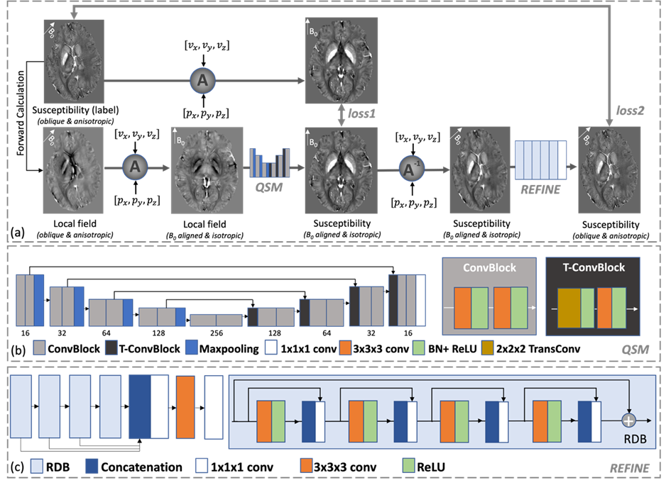
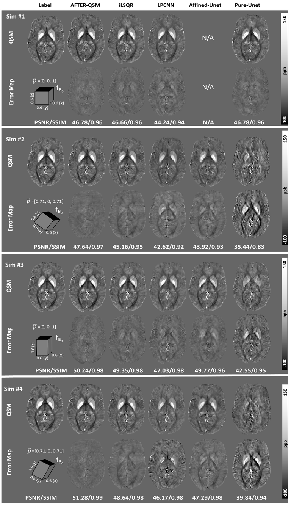

# Affine Transformation Edited and Refined (AFTER) Deep Neural Network for Quantitative Susceptibility Mapping

- This repository contains a dedicated deep neural network for quantitative susceptibility mapping from highly oblique and anisotropic resolution scans up to 0.6 mm.

- This code was built and tested on Window 11. It is recommended to have at least 8GB GPU memory to run the code.

- The paper has been published on Neuroimage: https://www.sciencedirect.com/science/article/pii/S1053811922009636?via%3Dihub.

##  Overall Framework 

Fig. 1:  Overview of the proposed AFTER-QSM training process. 

## Simulation Test 

## Usage 

- train: python train.py

    - root: The root directory of trainig dataset.
    - file_path: The sepcific path of each trainig data. 

    - depth: depth of Unet for QSM reconstruction.
    - recon_base:  base channel number of Unet for QSM reconstruction.
    
    - channel_num: number of channel for the sucessive refinement network.
    - refine_base: base channel number of the sucessive refinement network.
    - block_num: number of RDB blocks.
    - layer_num: number of layers in each RDB.
    - use_dense: Boolean value determining dense architecture or Squeeze And Excitation.

    - batch_size: batch size for training.
    - epoch: number of epoch for training.
    - gpu_num: number of GPU to be used for training.
    - padding: surrounding zero padding in case of rotating over the matix boundary.

    - lr1: learn rate of the optimizer for the recon model.
    - lr2: learn rate of the optimizer for the refine model.

    - drop_step1: drop_step of the optimizer for the recon model.
    - drop_step2: drop_step of the optimizer for the refine model.
    - alpha1: drop_rate of the optimizer for the recon model.
    - alpha2: drop_rate of the optimizer for the refine model.

Please implement PleaseImplementYourDataset by overriding the function path_composition in train.py

- test: python test.py

    - field_path: path to the testing data. 
    - vox: voxel size of the testing data.
    - z_prjs: voxel size of the testing data.
    
    - use_GPU: boolean value determining to use GPU or not.
    - GPU_NO: The number of GPU to be used for testing.
    
    - save_path: save path of testing result.
    - checkpoint_path: path of the selected checkpoint.
  
    - segment_num a compromise for memeory occpucation for more than 8GB but less than 12GB memory, 8 is preferable for less than 24GB 4 is preferable depending on the matrix size of the testing data.

    - data_type: direct recon if field, forward calculation otherwise.

