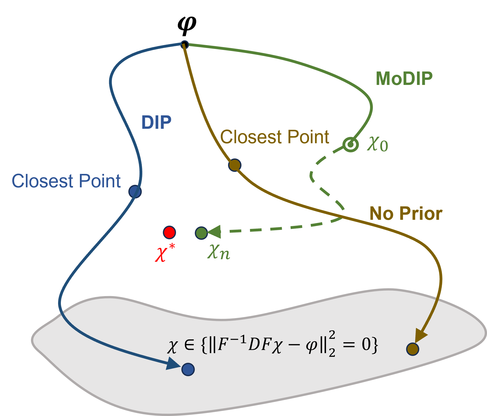

# MoDIP
The official code implementation of "Quantitative Susceptibility Mapping through Model-based Deep Image Prior (MoDIP)
https://www.sciencedirect.com/science/article/pii/S1053811924000788"


usage
```bash
python recon.py --data_path ./data --save_path ./result 
```
Key Arguments

- `--data_path` : path to the data folder

input specify
- `--is_fieldmap` : whether input is fieldmap or QSM.
- `--input_type`: Intial input of MoDIP chosen from pure, phi, noise. pure stands for field map in pure-axial orientation.

DFO Specify
- `--iter`: number of iterations for DFO.
- `--alpha`: step size for DFO.

DIP specify
- `--depth`: depth of U-net.
- `--base`: channel number of U-net.
- `--decoder_block_num`: number of decoder block.

others
- `--crop_background`: whether crop background. Background should be masked to 0 beforehand!
- `--padding_mode`: padding mode for QSM forward calculation.

*decrease channel number while increase iteration numbers for the DFO module if memory is not enough.*